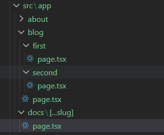
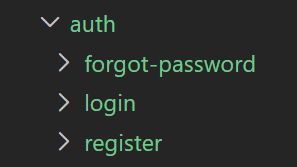

# 𝐍 NEXT.JS NOTES

---

## Next.js Introduction

### What is Next.js?
**Answer:**
Next.js is a React framework designed for better performance than React.js.

---

### What are the pros of using Next.js?
**Answer:**
- Routing
- API Routes
- Rendering
- Data Fetching
- Styling
- Optimization
- Dev and prod build System - Both client side and server side rendering made easy.
  
---

### Command to initialize a next.js application
**Answer:**
```bash
npx create-next-app@latest
```

---

### React Server Components (RSC)
**Answer:**
React Server Components is a new architecture that was introduced by the React team and quickly adopted by Next.js. This architecture introduces a new approach to creating React components by dividing them into two types:
- Server components:
    - By default, Next.js treats all components as Server components.
    - These components can perform server-side tasks like reading files or fetching data directly from a database.
    - However they can't use any hooks or monitor user interactions.
- Client components
    - To create a Client component, you'll need to add the "use client" directive at the top of your component file.
    - While Client components can't perform server-side tasks like reading files, they can use hooks and handle user interactions.
    - Client components are the traditional React Components.

---

### Routing
**Answer:**
- Next.js has a file-system routing system.
- URLs you can access in your browser are determined by how you organize your files and folders in your code.

---

### Routing Conventions
**Answer:**
- All routes must live inside the app folder
- Route files must be named either page.js or page.tsx
- Each folder represents a segment of the URL path

---

### Dynamic Routes.
**Answer:**
Dynamic Routes are created by giving [PLACEHOLDER] as the folder name.

---

### Demo for obtaining a value through params in Dynamic Route.
**Answer:**
File structure:
- Products
  - [productId]
    - page.tsx
page.tsx:

```tsx
export default async function ProductDetails({
    params,
} : {
    params: Promise<{productId : String}>
}){
    const productId = (await params).productId;
    return <h1>The product Id is {productId}</h1>
}
```

---

### Catch all segments.
**Answer:**
Used to handle multiple urls as in /feature1/concept1/example1 and so on.
```tsx
export default async function Docs({ params }: { params: Promise<{ slug: string[] }> }) {
    const {slug} = await params;
    if(slug?.length === 2){
        return <h1>Inside docs of feature :{slug[0]} with concept :{slug[1]}</h1>
    }else if(slug?.length === 1){
        return <h1>Inside docs of a unique feature number :{slug[0]}</h1>
    }
    return <h1>Docs Home Page</h1> //*Usage mentioned below
}
``` 
However for this kind of structure, the output for /docs will be a error (404 Not found).\
\
In order to handle that and display something instead of the *404 error* message, We can wrap the slug with an another square brackets ( [[..slug]] ). Thus the message in * gets printed in case if /docs is accessed.

However this practice must be followed only at times where the UI is same for all the pages under /docs. If not creating a separate page.tsx under docs folder is recommended.

---

### Not found Error custom message
**Answer:**
Create a file as app/not-found.tsx and edit its content to overwrite the contents of the not found error.

The notFound error can be explicitly thrown from any file and specific not-found exception handling can be done in the same page itself.\
Example:

```tsx
import { notFound } from "next/navigation";

export default async function({
    params,
}: {params : Promise<{productId: string; reviewId: string}>}){
    const {productId, reviewId} = await params;
    if(parseInt(reviewId) > 1000){
        notFound();
    }
    return <h1>This is review number: {reviewId} for product :{productId}</h1>
}
```

And if this specific not-found can be captured by having a not-found.tsx file in the same folder.
> The notFound component does not accepts any props.

Since it doesn't accept props for detailed error handling. One can use the usePathName function under next/navigation and extract the parameters from the path.

> 'usePathName' can only be used in client-side, so it advised to add "use client" on the top of the file.

---

### Private Folders
**Answer:**
- A way to tell Next.js not to include it in the routing system.
- The folder and all its subfolders are excluded from routing.
- Add an underscore at the start of the folder name.
  
---

### Benefits of using Private Folders
- Keeping your UI logic separate from routing logic.
- Having a consistent way to organize internal files in your project.
- Making it easier to group related files in your code editor.
- Avoiding potential naming conflicts with future Next.js file naming conventions.

> If you actually want an underscore in your URL , use "%5F" instead. That's just
the URL-encoded version of an underscore.

---

### Route Groups
Lets one to logically organize the routes and project files without impacting the URL structure.\
\
for the above mentioned way of structuring we need to access the pages by /auth/login.
But if the route group is wrapped in () i.e (auth) then we can access by just specifying them only /login as () treats the folder as a organization tool only.

---

### Layouts
- Layouts are specific UI that can be used anywhere in your project. Example: **Header and Footer**.
- In order to create a Layout default export a react component as layout.js or layout.tsx file.
- That component takes a children prop, which Next.js will populate with your page content.
  
---


